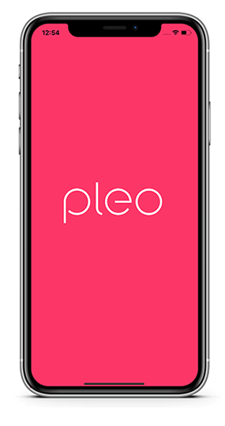

# Pleo Mobile Challenge
This app is developed as a mobile development challenge by the company Pleo. It's developed in React Native but includes a native camera picker element from native iOS Swift.

# Screenshots
  

## How long did it take?
It took about 18 hours of work. That includes prototyping the design and implementation.

## Which part was the hardest to implement?
The hardest part was the bridge between React Native and Swift as the documentation available on this topic is not sufficient.

## What functionalities are you most proud of?
Picking up the image from native iOS code and sending it to react native for use using Event Emitter is the best part.

## Functional requirements
- User can list expenses
- User can add a comment on an expense
- User can filter on expenses (client side filters)
- User can add a receipt image on an expense

## Extra Functionality
- Implementation with state management library Redux
- Used Redux-Thunk Middleware
- Native iOS swift camera module for uploading receipt images

## Libraries Included 👇
- Redux
- React Navigation
- Redux Thunk
